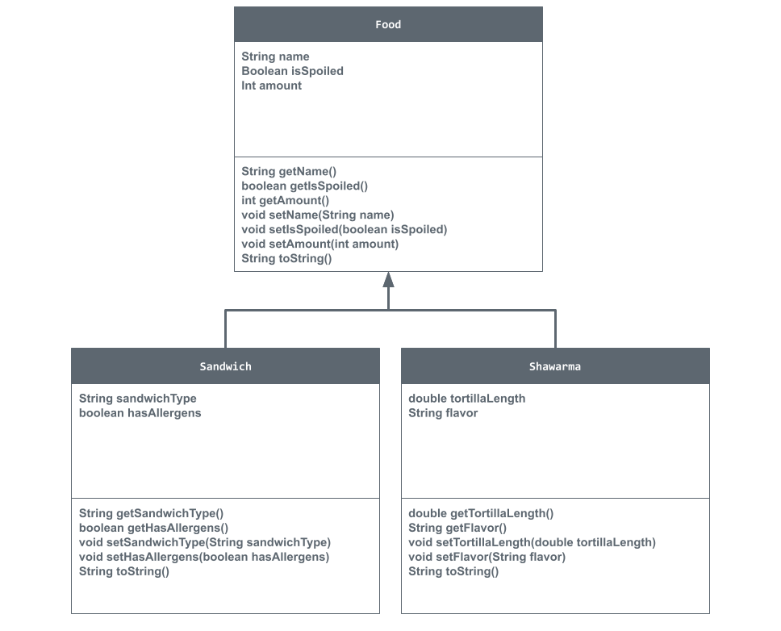

# Unit 2 - Store Management Project

## Introduction

You are opening a new business in your community! Businesses often need programs to manage the products and services they offer and track orders and requests from customers. Your goal is to create a store management system for your business.

## Requirements

Use your knowledge of object-oriented programming and class structure and design to create your store management system:
- **Create a class hierarchy** – Develop a superclass that represents a product or service your business offers and one or more subclasses that extend the superclass to represent more specific types of products or services.
- **Declare instance variables** – Declare instance variables in the superclass that are shared with the subclasses and instance variables in the subclasses that are not shared with the superclass.
- **Write constructors** – Write no-argument and parameterized constructors in the superclass and subclasses. Subclass constructors use the super keyword to call the superclass constructor.
- **Implement accessor and mutator methods** – Write accessor and mutator methods for instance variables that should be accessible and/or modifiable from outside of the class.
- **Implement a toString() method** – Write toString() methods in the superclass and subclasses that return information about the state of an object.

## UML Diagram

## Description

In the making of this project, I made a diner instead of a store because I couldn't think of anything good. My diner has storage in the pantry which is what the code is based off of. The PantryRunner() will show all the classes of food in storage and will list the name of the food, the amount in storage, and if the food item is spoiled or rotten. The superclass is the Food class which in the PantryRunner(), the food is burger. The subclasses are the Sandwich and Shawarma classes which each have two seperate instance variables other than the ones listed before. I chose to make this project based off of a diner's pantry because I love food and wish to become a chef one day. I didn't use user's input because I had just learned how to use it and it didn't always work. But I think what I've done is still pretty good.